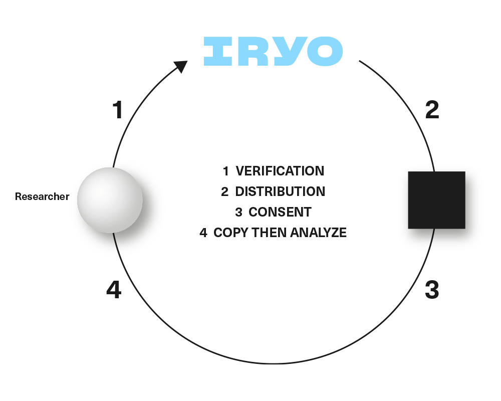
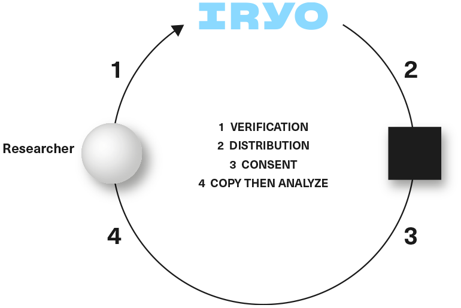
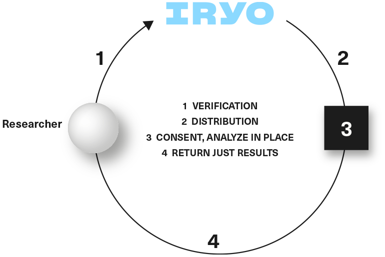

# **Anonymous query interface **

### **enables AI learning over distributed & encrypted data**

Since health data doesn’t decrypt itself without patient consent, a new approach needs to be devised to allow for machine learning and AI capabilities. There are many complicated ways, from both a development and resource standpoint, to query encrypted data \(e.g. multi-party computation and proxy re-encryption\).

Fortunately, there is an actual ‘trusted device’ in the Iryo Network end-user device. This could be a phone, tablet or personal computer. Since these devices need to be able to read all health data in plain text, they would also be able to execute the queries across the same data.

A process to deliver queries to end-user without breaking its anonymity or given consent needs to be defined. Iryo has a solution to this process gap.

1. First Iryo would verify research institutions to make sure they are legitimate and not attempting to commercialize confidential information by re-selling the collected data.

2. Researchers would receive the Iryo Research Portal software which they can use to send queries to the Iryo Network, using the [‘Archetype Query Language’](https://www.gitbook.com/book/iryo/whitepaper/edit#) \(AQL\), and openEHR specification.

3. When they do, Iryo would verify the query first. This is to check that the query is not too broad or asking for information repetitively which could indicate an attempt to reconstruct records \(if done over an extended period of time\).

4. The patient's own device verifies that the patient meets the query criteria. If the verification is successful, the query details with the name of the research institution and the amount of tokens to be received by a patient is shown on the device pending approval.

In actual implementation, the patient's device will receive a silent notification which will wake up a background process to query the requested criteria i.e. female, 30-35 years old with diabetes. If a patient does not fall within the defined parameters, the silent notification disappears. It will do so without providing a report to the requester thereby keeping patient-users anonymous. If the patient meets the criteria, a notification would be shown on the patient’s device. The notification would include the name of the research institution, the justification for the query requested i.e. the aim\(s\) of the research, and the number of tokens available as an incentive to allow query results to be sent back.

Iryo envisions three types of opt-out, anonymous requests that present various potential implications for privacy which would require distinct user consent. These types are identified as a pseudo anonymous query, an anonymous query used for AI validation across a dataset and an anonymous query to deliver patient value.

## **Copy then analyse**

### **PseudoAnonymous query - used for AI training dataset**

This is a request for medical data in plain form, without the directly identifiable personal information \(pseudonymous\). This bears high costs \(in the region of $100 worth of IRYO tokens\) since, even without personally identifiable information, this data can still be used to match against other databases and individuals could be identified if that data leaks from the researcher[^1].

The number of these requests should be kept low \(up to 100 patients\) to train and test machine learning algorithms freely. After results are determined and the algorithm needs to be validated \(or invalidated\) over much bigger population sample size, they proceed to the next type of query.

**                  
**

## **Analyze in place**

### **Anonymous query- used for an AI validation dataset**

This is an anonymous query across medical data that bears a very low cost \(estimated at $0.1 worth of IRYO tokens\). This is because this request takes data, applies a formula to it, and then only sends back the result in numerical or binary form \(true/false\). There is no leakage of personal information and it cannot be compared to other databases.

These requests can be sent to all users in the Iryo Network and can be used to train and test machine learning algorithms, until a verified researcher finds and validates the missing link.

### **Anonymous query- used to provide patient value that saves lives**

This is an anonymous query across medical data that does not return binary responses, but rather shows actionable results. Its philosophy is that researchers should/could share the actionable algorithms that they have validated to improve decision making, for example. Of course, to avoid health risks, algorithms need to be validated by a regulatory authority like the Food and Drug Administration \(FDA\) or European Medicines Agency \(EMA\). This must be done before the insights derived from this platform can be considered as accepted medical advice \(i.e. clinically verified\) and is offered to Iryo patients.

## **Benefits for researchers**

Researchers will have access to larger research populations which would result in more robust research results. They will be able to use the Iryo Research Portal to enroll people with specific health conditions as determined by parameters selected by them. Direct access to EHRs of specifically defined patients can decrease the time required for patient recruitment, thereby potentially decreasing pre-recruitment process costs. Typically, recruitment agencies and services need to first attract potential patients and then check their eligibility. This can be a lot more time consuming than a query in the Iryo Network. The simplification of the research process is outlined in the steps below:

Obtain 100[^2] individuals who respond to the query, and collect their health data.

1. Use machine learning \(AI\) to identify trends and test hypotheses.

2. Verify learned formulas on 10 000[^2] more people with anonymous query, without ever exposing their information.

Since the Iryo Network scales better to more patients internationally \(due to its inherent privacy\), researchers would be able to approach more people and therefore enhance the robustness of their research findings.

## **Benefits for Patients - find actionable early indicators of health problems/diseases **

Patients will be alerted to their identified modifiable risk factors of disease and indicators that may suggest the early onset of disease Once correlations are clinically verified, users would get the anonymous queries that would seep through their data and present them with actionable advice. For example, they will receive information on which healthcare provider they need to consult and which tests would be beneficial for them to have. Those queries would not be reported back, and would remain on the patient’s phone.

With Iryo’s innovative design, patients now have the option to not share their health information but still receive research results – something that has not been achieved until now.

If the patient \(older or non-technical\) does not possess a smartphone or the IryoEHR app, they could give permission to their doctor to allow research to be conducted on their data after an approval processes at the clinic.

[^1]: [Privacy for research participants](https://en.wikipedia.org/wiki/Privacy_for_research_participants)

[^2]: fictitious values used for illustrative purposes

