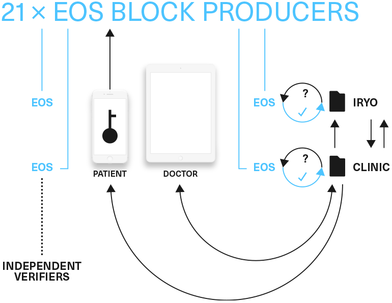

# **Blockchain permission controls**

End-users can issue signed permission messages to the blockchain. This includes:

* sharing all electronic health records with their personal doctor \(with or without time limits\),

* the revocation of access to their EHR

* the sharing of limited relevant parts of health records with a specialist \(with a time limit\). Inpatient medical records will also be partitioned with a separate set of access rules.

* issuing IoT device permissions to write but not to read data

* rotating the re-encryption key

The use of the smart contracts for permission controls is optional \(there is no double spending problem\). Iryo would use it, because that way the EOS node can compute the state at the moment it received the ordered message, instead of waiting for the query to compute it i.e. where the state gets pre-computed.

Permission controls benefit from being in the blockchain in the following ways:

* **Trustless timestamping**. All Iryo full nodes, including consensus “block-producing” nodes, would validate all messages. Therefore there will not be any doubt with regards to what and when blockchain permission messages were issued.

* **Immutable log of all messages**. It will not be possible to deny that a valid access request was issued. This will reduce the possibility of litigation where dishonest parties claim that access permissions were never issued.

* Once your message gets included in the blockchain, **one part of the network cannot withhold it from another**. That way, users can always be sure that they have all the revocations, that is, assuming they are running the Iryo full node \(which is still just a tiny subset of the whole EOS network\).

All storage endpoints \(in the cloud and in the clinics\) would run their independent Iryo ledger full node. A smart contract would be used to prepare the local state. A direct query on the full node would return either a true or false response for each access request that the Iryo \(storage\) network would need to process.

simplified overview

