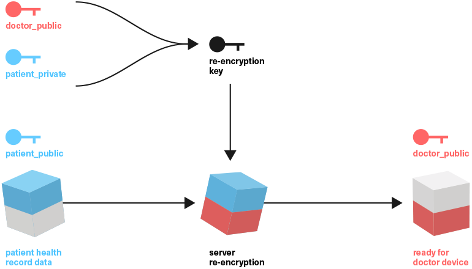

# **Cryptographic enforcement of permissions**

### **over data using Proxy re-encryption \(NuCypher\)**

Public key cryptography \(PKC\) also known as asymmetric cryptography uses a key-pair of public-private keys to encrypt and decrypt data. This property gives the user the ability to share public keys outside of his control. PKC based on an elliptic curve is mostly used for digital data signing but it can be also used for data encryption.

[ECIES encryption](https://www.gitbook.com/book/iryo/whitepaper/edit#) allows one to asymmetrically encrypt data with a public key and decrypt it using private key, instead of the typical two-way symmetric AES cipher which uses one key for encryption and decryption. This is done by creating an ephemeral random key based on the receiver’s public key. Data is then symmetrically encrypted using this ephemeral key.

This key is then cryptographically encrypted so that only the owner of the private key that corresponds to the public key can decrypt it. The encrypted data, along with encrypted ephemeral key is sent to the receiver. This means that the patient can share his public key with anybody to give them write-only permission.

> ECIES \(patient\_public, data\)

To read the data, an [Umbral](https://github.com/nucypher/nucypher-kms/blob/master/nkms/crypto/api.py#L384) algorithm is used, which allows patient to issue re-encryption keys. These keys can take the data and re-encrypt them to a doctor’s public key on the fly.To create a re-encryption key, patient\_private, doctor\_public keys are used. A re-encryption key is then used to re-encrypt the data \(encrypted ephemeral key\) from the patient to doctor public key.

  
Iryo storage nodes can hold patient issued, re-encryption keys, and re-encrypt all patient data to doctor on the fly. Since the data gets transmuted on the server, Iryo only needs to keep one copy of the same data while keeping it zero-knowledge.

In reality, the ECIES encryption is very slow. This is why NuCypher uses hybrid encryption scheme. The data is first encrypted with temporary key using AES symmetric cipher and this key is then encrypted with sender's public key using ECIES. Re-encryption is then done only over an encrypted temp key rather than whole data. Their [whitepaper](https://cdn2.hubspot.net/hubfs/2807639/NuCypher KMS Technical White Paper.pdf) provides a more detailed explanation.

NuCypher is building a decentralized service but, since Iryo has more trusted topology, it can achieve the same \(or better\) security properties when deploying the re-encryption software from the two storage nodes from which each user has their data served from.

# **Public key derivation \(**[**BIP32**](https://github.com/bitcoin/bips/blob/master/bip-0032.mediawiki)**\)**

For the sake of simplicity of the paper, we only mention one encryption key-pair. In reality, the keys are deterministically derived from master private key. Separate child keys are used for different access permission levels. Each public child key would get separate re-encryption key. This way the patient would have mathematical control of the level of permissions each doctor/specialist would get. [Youbase's whitepaper](https://paper.youbase.io/content/structured-data.html#path-levels) provides a good example of that model.

## **Key rotation**

When access is revoked, a patient would issue new re-encryption keys for all new data. For old data, NuCypher proxy re-encryption relays on the servers to not serve the revoked clients \(with data or re-encryption keys\). In our case, the Iryo storage node and clinic storage node would simply throw the revoked re-encryption keys away and, by doing this, they protect the data even if the storage node gets hacked later, and all encrypted data leaked.

Due to BIP32 and proxy re-encryption, the key rotation process does not need any other device but the patient’s to be online \(it's non-interactive\). This value is enhanced in the doctor’s case, as he can re-issue all re-encryption keys to himself without ‘bothering’ any of their patients.

