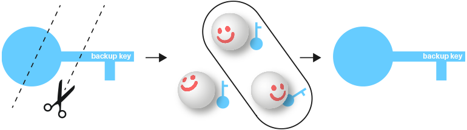

## **ZeroPass App**

ZeroPass is a passwordless keychain and private key recovery manager. It can store keys in a zero-knowledge manner and provides trustless recovery that works even if ZeroPass servers are down. The development of the ZeroPass app is currently in the private beta stage.  
For an in-depth understanding of this app, you can read more on the [ZeroPass website](https://www.zeropass.io/) or fairly [technical whitepaper](https://www.gitbook.com/book/zeropass/whitepaper/details).

To use a key from ZeroPass users don’t need to remember anything; instead they need to sign every request for a requested key with two devices. These devices must have previously been paired with the ZeroPass app or, optionally, via YubiKey-style devices \(FIDO compliant\).

Later, ZeroPass would add multisignature transaction signing \(thresholdECDSA\), which will be used to provide an extremely secure signing process using a private key.**The transaction spending stays secure even if one of the user’s devices is infected by malware**.This capability will be tightly integrated into IryoEHR app’s token functionality.

If users lose their devices \(referred to as ZeroPass “factors”\) and/or lock themselves out, two out of three trusted contacts which they had nominated can help them recover their key within the app or offline \(where the service is unavailable online\).

If users lose their devices \(referred to as ZeroPass “factors”\) and/or lock themselves out, two out of three trusted contacts which they had nominated can help them recover their key within the app or offline \(where the service is unavailable online\).**         
**

## **ZeroPass 4Teams app**

ZeroPass 4Teams will provide clinics and Iryo multi-member teams environment with all of the core ZeroPass functionalities and benefits, while at the same time also taking into consideration their specific requirements:

* a global overview of all members and their actions,

* access to signing using a private key for multiple users \(sharing functionality\),

* an adjustable level of security \(how many users and/or devices per user are required to sign a transaction or get access to the key\).

User-owned devices will be encouraged as the primary and/or secondary factors. This is a ZeroPass answer to provide security in the rising ‘bring your own device trend’ \(BYOD\). Knowing that 50%+ of all employees use their own devices for work, the trend does not seem to be slowing down.

All described key \(and subsequently health data\) recovery procedures might be rendered useless in extreme situations, such as long internet outages which place lives in danger. Disaster access modes have been developed as a solution to avoid the potential negative consequences of these situations. Patients or clinics may opt-out of these modes. These are explained in the edge cases below.

### **Edge case: Emergency access for individual users**

SCENARIO: Alice is an unconscious patient who is rushed to the hospital by an ambulance in the middle of the night.

The previous assumptions about a patient or their personal doctor being able to unlock the data can prove fatal in those cases. The solution is to escrow \(split with Shamir Secret Sharing\) the re-encryption key within the ZeroPass 4Teams app and lock it with the smart contract that is enforced by the ZeroPass server. The smart contract rules state that if the clinic wants to access the \(missing half\) of the key for patient Alice \(identified with her public key\), the clinic needs to put $1 000 worth of IRYO tokens \(adjustable by Alice\) to the 1-month contract with her EOS wallet public key.

Once this is done, Alice’s IryoEHR app will show her the notification. If her medical data access was unjustified she has 1 month to claim the $1 000-worth of tokens. If it was a legitimate life-threatening situation she can either approve the refund to the clinic or wait a month for the contract to expire - this would automatically return all the tokens to the clinic.

To stake the coins for emergency request, the clinic takes the tokens it already has from their wallet \($10 000-worth of IRYO tokens\) and has 1 month to replenish the stake if it gets under ‘staking requirement’ for the clinic. This way they don’t need to rush while trying to buy the token in an already stressful situation- it’s just a matter of enough people in the clinic approving access. If multiple devices of a clinic were hacked \(very low probability\), the clinic’s stake would be drained and the hack would stop after 10 unauthorized accesses \(because the clinic would run out of tokens\).

Instead of more than 1 000 stolen electronic health records only up to 10 records can be leaked in the catastrophic event of a data breach.

Potential abuse of this edge case functionality:

1. If Alice \(patient\) abuses the stake; the clinic can invoice her and later file a lawsuit if the invoice was not paid for.

2. If Alice’s hospital issued fraudulent requests she gets automatically compensated and can sue based on the public blockchain proof of the breach. That holds true even if the clinic refuses to notify her of that catastrophic breach to multiple clinic personnel devices.  **          
   **

### **Edge case: Disaster ‘Health Records’ access mode for clinic**

ZeroPass 4Teams recovery works the same way as the non-team version; two out of three trusted users can help recover stored keys in the team app. Those trusted users might not have the app themselves and would need other team members to prevent \(offline\) abuse.

This mode proves to be especially effective in cases where natural or other disasters occur and connection to the internet is cut off or clinics’ devices are destroyed. Two out of three ZeroPass 4Teams trusted contacts can meet offline with team members that have the app and recover every single stored key together.

These modes are not designed to be extra easy for the user experience because a higher level of coordination prevents hackers from abusing this disaster access mode. Hopefully, disaster access mode for clinics would never be used.

High net-value individuals, heads of the state and other individuals that might be targeted by criminal or nation-state hacking activities \(for instance, during a war\) can opt-out from the recovery access modes from the start. Individual patients can opt-out as well, as long as they provide consent indicating that they understand the risks and use the ZeroPass private key recovery app to its full extent \(with added two out of three trusted contacts. Opting-out should be discouraged by the clinic on an individual level because these fail-safe modes can help save patient lives.

